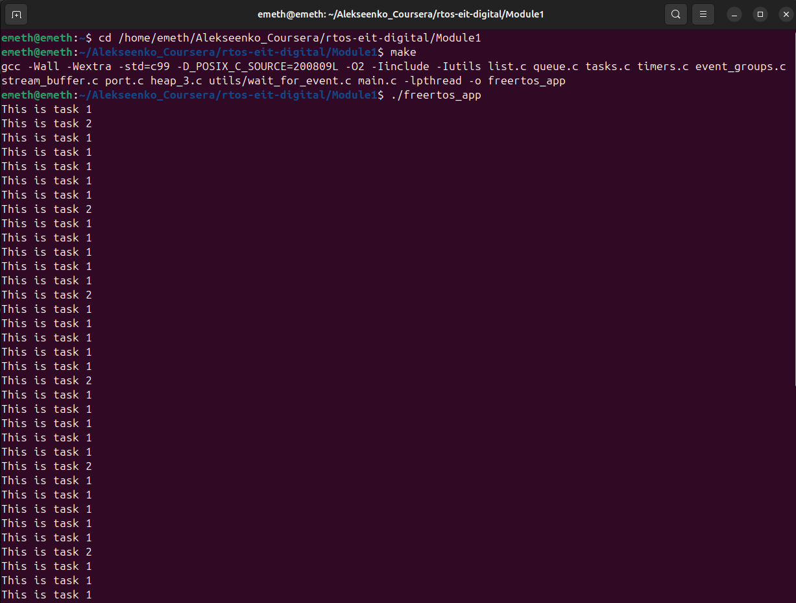

## FreeRTOS Course Assignment 1

> Completed as part of the *Development of Real-Time Systems* course (EIT Digital).

A minimal POSIX-based FreeRTOS demo implementing two periodic tasks:

- **Task1**: prints `This is task 1` every 100 ms at priority 3  
- **Task2**: prints `This is task 2` every 500 ms at priority 1

### Building & Running

```bash
make clean
make
./freertos_app
```

In the terminal will see the output:



