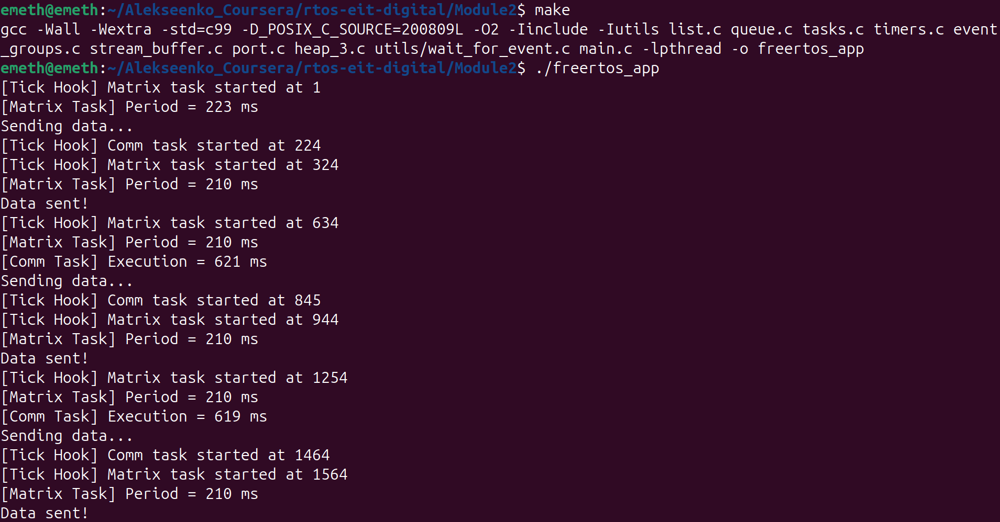

## FreeRTOS Course Assignment 2

> Completed as part of the *Development of Real-Time Systems* course (EIT Digital).

A minimal POSIX‑based FreeRTOS demo implementing three tasks and dynamic priority management:

- `matrix_task`: performs heavy CPU‑intensive matrix multiplication every cycle (plus dummy delay), at initial priority 3; measures and prints its period each iteration.  
- `communication_task`: simulates I/O by printing *“Sending data…”* then *“Data sent!”* with 100 ms delays (total 200 ms period), at initial priority 1; measures and prints its own execution time each cycle.  
- `priority_set_task`: monitors `communication_task` execution time inside the task and adjusts its priority — raises to 4 if execution time > 1000 ms, lowers to 2 if < 200 ms.

### Building & Running

```bash
make clean
make
./freertos_app
```

**Sample Output:**



This log provides both the period of `matrix_task` and the execution time of `communication_task`, allowing verification of deadlines and priority changes.

> **Nota bene:** According to the original assignment, `communication_task`’s priority should only be raised when its execution time exceeds **1000 ms** (and lowered when it’s below **200 ms**). In the sample run above, execution times never reach **1000 ms**, so we won’t see the “raise to 4” event under normal load. To demonstrate the priority boost, we can either simulate a longer delay in `communication_task` or *temporarily reduce* the **1000 ms** threshold for testing purposes.

### Pre-requisites for project building

This assignment reuses the project structure from [Module 1](https://github.com/cloclacordis/rtos-eit-digital/tree/e84920b77fee42bcd3ca450efcebd4cdbd2e5602/Module1), with some modified files.

To prepare the project copy all files and folders from `Module1` into `Module2` **except**:

- `main.c`
- `port.c`
- `README.md`
- `assets/`

> These four elements must be the original ones from the `Module2` folder.

After replacement, **the `Module2` directory structure** should look like this:

`assets/` <- original `Module2`, *not copied* from `Module1`  
`croutine.c`  
`event_groups.c`  
`FreeRTOS-simulator-for-Linux.url`  
`heap_3.c`  
`include/`  
`list.c`  
`main.c` <- original `Module2`  
`Makefile`  
`port.c` <- original `Module2`  
`queue.c`  
`README.md` <- original `Module2`  
`stream_buffer.c`  
`tasks.c`  
`timers.c`  
`utils/`

### Assignment Questions & Answers

As part of the assignment requirements, the following questions were posed. Below are answers based on the implemented system behavior:

1. **Why is `matrix_task` using most of the CPU utilization?**
> It runs a long dummy loop (1 × 10⁹ NOPs) plus a full 10×10 matrix multiplication with nested loops each cycle, which monopolizes the processor.

2. **Why must the priority of `communication_task` increase in order for it to work properly?**
> Because `matrix_task` (priority 3) otherwise hogs the CPU, the lower‑priority I/O task misses its 200 ms period unless its priority is boosted so it can preempt.

3. **What happens to the completion time of `matrix_task` when the priority of `communication_task` is increased?**
> Its effective period grows (it takes longer per cycle) because `communication_task` preempts it more often.

4. **How many seconds is the period of `matrix_task`?**
> Measured inside the task via `xTaskGetTickCount()`, its period averages **0.21 seconds** (210 ms).
