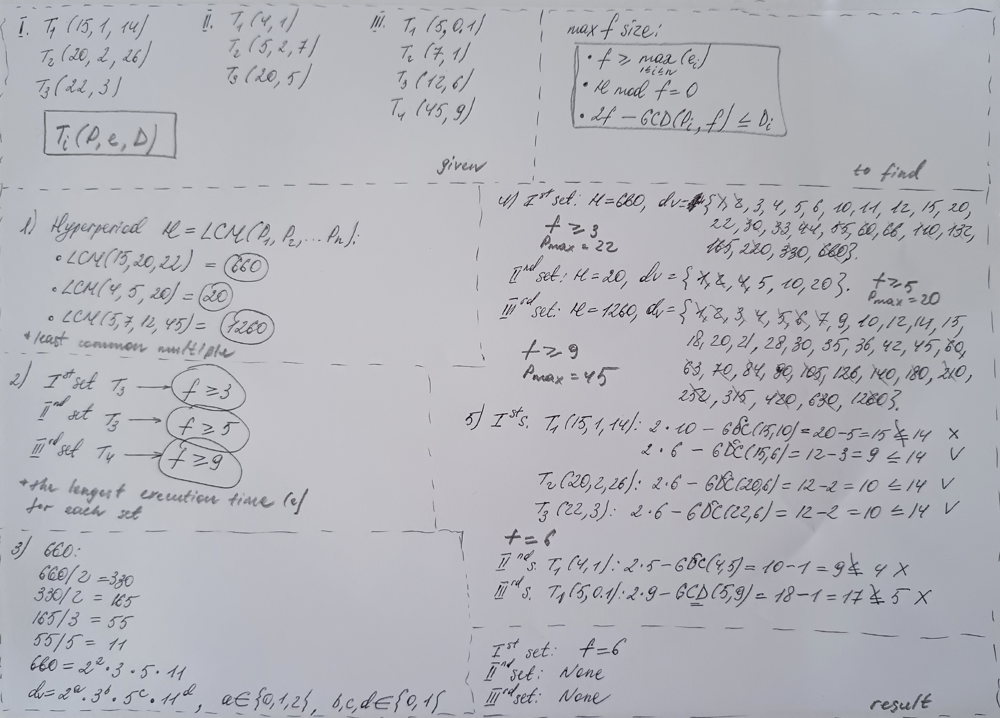

## Task Overview

There are two tasks: one **computational** — to compute a feasible cyclic schedule, and the other is a **simulation** — to verify its feasibility using a **real-time simulator**. Below are the detailed calculation journal.

---

### First Task — Сomputational

#### Given

For the cyclic scheduler, **three task sets** are provided:

**First Task Set**

| **Task**         | **P** | **e** | **D** |
| ---------------- | ----- | ----- | ----- |
| T<sub>1</sub>    | 15    | 1     | 14    |
| T<sub>2</sub>    | 20    | 2     | 26    |
| T<sub>3</sub>    | 22    | 3     | 22    |

**Second Task Set**

| **Task**         | **P** | **e** | **D** |
| ---------------- | ----- | ----- | ----- |
| T<sub>1</sub>    | 4     | 1     | 4     |
| T<sub>2</sub>    | 5     | 2     | 7     |
| T<sub>3</sub>    | 20    | 5     | 20    |

**Third Task Set**

| **Task**         | **P** | **e** | **D** |
| ---------------- | ----- | ----- | ----- |
| T<sub>1</sub>    | 5     | 0.1   | 5     |
| T<sub>2</sub>    | 7     | 1     | 7     |
| T<sub>3</sub>    | 12    | 6     | 12    |
| T<sub>4</sub>    | 45    | 9     | 45    |

> Task structure: **T<sub>n</sub>(P,e,D)**,  
where **P** — *period*, or time between two consecutive task activations;  
**e** — *execution time*, or duration required for normal task completion;  
**D** — *deadline*, or maximum time by which the task must be completed.  
> If the deadline **D** is not explicitly specified — as in **T<sub>3</sub>(22,3)** — then **D = P**, hence **T<sub>3</sub>(22,3,22)**.

---

#### To Find

To find, for each of the three task sets, the **largest feasible frame size** that satisfies the following **three requirements**:

**1**. **Task duration**. Each task **i** must start and complete within a single frame **f**. Therefore, the frame size must be no less than the maximum execution time:  
**f ≥ max<sub>1≤i≤n</sub>(e<sub>i</sub>)**,  
where **e<sub>i</sub>** is the execution time of task **i**.

**2**. **Hyperperiod divisibility**. The frame size must divide the hyperperiod evenly: **H mod f = 0**, i.e., **f** divides **H** with no remainder.

> The **hyperperiod** is the shortest interval that contains all task periods. Mathematically, it is the **least common multiple (LCM)** of all task periods in the given set.  
> In practice, the hyperperiod can be used to verify feasibility: if the schedule meets all deadlines within one hyperperiod, it will always meet them.  
> To determine the number of frames **F** in a hyperperiod **H**, a simple division is used: **F = H / f** (not to be confused with the divisibility check **H mod f = 0**).

**3**. **Interval between release time and deadline**. There must be at least one frame that fits within the interval between a task’s release time and its deadline.  
In other words, **2f − GCD(P<sub>i</sub>, f) ≤ D<sub>i</sub>**,  
where **f** is the frame size;  
**P<sub>i</sub>** is the period of task **i**;  
**D<sub>i</sub>** is the deadline of task **i**;  
**GCD(P<sub>i</sub>, f)** is the **greatest common divisor (GCD)** of the task’s period and the frame size.

---

#### Conditions

The solution is carried out using a sheet of paper and a pen. **Draft solution**:



> The solution logic is explained in detail below, followed by an example of how the calculations can be automated.

---

#### Solution

**Search Logic**

1. Find the hyperperiod **H = LCM(P<sub>1</sub>,P<sub>2</sub>,...,P<sub>n</sub>)**.  
2. Select candidate frame sizes **f** that satisfy both of the following:  
- **f** is a divisor of **H**,  
- **f ≥ max<sub>1≤i≤n</sub>(e<sub>i</sub>)**.  
3. Check whether each candidate **f** satisfies the condition **2f − GCD(P<sub>i</sub>, f) ≤ D<sub>i</sub>** for every task.  
4. From the values of **f** that pass the test, choose the **largest** one for each task set.

---

**Step 1**

First, find the **LCM** of task periods **P** for each set.

- First set: LCM(15,20,22) = **660**.  
- Second set: LCM(4,5,20) = **20**.  
- Third set: LCM(5,7,12,45) = **1260**.

> To compute the LCM of several positive integers by hand:  
> factor each number into its prime components,  
> take the highest power of each unique prime factor among all the numbers,  
> multiply them — the result is the LCM.
>
> For example, LCM(12,18):  
> 12 = 2<sup>2</sup> * 3,  
> 18 = 2 * 3<sup>2</sup>,  
> LCM = 2<sup>2</sup> * 3<sup>2</sup> = 36.

**Example of automated LCM computation for positive integers**

```python
import math
from functools import reduce

# Function to compute LCM of two numbers
def lcm(a, b):
    return abs(a * b) // math.gcd(a, b)

# Function to compute LCM of a list of numbers
def lcm_multiple(numbers):
    return reduce(lcm, numbers)

# Function to get user input and validate it
def get_numbers():
    while True:
        user_input = input("Enter numbers separated by spaces to find LCM: ")
        parts = user_input.strip().split()
        try:
            numbers = [int(p) for p in parts]
            if not numbers:
                raise ValueError("The list is empty.")
            if any(n <= 0 for n in numbers):
                raise ValueError("All numbers must be positive integers.")
            return numbers
        except ValueError as e:
            print(f"Input error: {e}. Please try again.\n")

# Main function
def main():
    numbers = get_numbers()
    result = lcm_multiple(numbers)
    print(f"LCM of {numbers} = {result}")

if __name__ == "__main__":
    main()
```

Sample run:


---

**Step 2.1**

For each set, find the minimum frame size requirement **f**, i.e., the task with the longest execution time **e**.

- First set: task T<sub>3</sub>(22,3), hence **f ≥ 3**.  
- Second set: task T<sub>3</sub>(20,5), hence **f ≥ 5**.  
- Third set: task T<sub>4</sub>(45,9), hence **f ≥ 9**.

---

**Step 2.2**

According to the requirement, the frame size must divide the hyperperiod **H** exactly. To find all divisors of 660, we first factor the number into prime components:

- 660 / 2 = 330,  
- 330 / 2 = 165, not divisible by 2 anymore -> record 2<sup>2</sup>,  
- 165 / 3 = 55, not divisible by 3 anymore -> record 3,  
- 55 / 5 = 11 -> record 5,  
- 11 — a prime number -> record 11,  
- **660 = 2<sup>2</sup> * 3 * 5 * 11**.

To find all positive divisors, we must try all possible exponent combinations of the prime factors:

- from 0 to 2 for base 2: 2<sup>0</sup>, 2<sup>1</sup>, 2<sup>2</sup>,  
- from 0 to 1 for bases 3, 5, and 11 (since they appear only once in the factorization).

The general formula for a divisor is:  
**div. = 2<sup>a</sup> × 3<sup>b</sup> × 5<sup>c</sup> × 11<sup>d</sup>**,  
where **a ∈ {0,1,2}, b, c, d ∈ {0,1}**.

The number of such combinations is:  
(2 + 1) × (1 + 1) × (1 + 1) × (1 + 1) = 3 × 2 × 2 × 2 = **24 divisors**.

To generate all divisors, go through all valid combinations of **a**, **b**, **c**, and **d**:

- a = 0, b = 0, c = 0, d = 0 -> 2<sup>0</sup> * 3<sup>0</sup> * 5<sup>0</sup> * 11<sup>0</sup> = 1,  
- a = 1, b = 0, c = 1, d = 1 -> 2 * 1 * 5 * 11 = 110,  
- a = 2, b = 1, c = 1, d = 1 -> 4* 3 * 5 * 11 = 660,  
- ...

> And so on — until all 24 combinations are generated.

**Automated divisor search example for a positive integer**

```python
def get_divisors(n):
    if not isinstance(n, int) or n <= 0:
        raise ValueError("Input must be a positive integer")

    divisors = []
    for i in range(1, int(n**0.5) + 1):
        if n % i == 0:
            divisors.append(i)
            if i != n // i:
                divisors.append(n // i)
    return sorted(divisors)

# Example usage:
number = int(input("Enter a positive integer: "))
print("Divisors:", get_divisors(number))
```

Sample run:


---

So, **all** divisors of the hyperperiod **H** for each task set:

- For the first set, **H = 660**: 1, 2, 3, 4, 5, 6, 10, 11, 12, 15, 20, 22, 30, 33, 44, 55, 60, 66, 110, 132, 165, 220, 330, 660.  
- For the second set, **H = 20**: 1, 2, 4, 5, 10, 20.  
- For the third set, **H = 1260**: 1, 2, 3, 4, 5, 6, 7, 9, 10, 12, 14, 15, 18, 20, 21, 28, 30, 35, 36, 42, 45, 60, 63, 70, 84, 90, 105, 126, 140, 180, 210, 252, 315, 420, 630, 1260.

Apply the **minimum frame size constraint** **f**, and get:

- For the first set, **f ≥ 3**, **f = {3, 4, 5, 6, 10, 11, 12, 15, 20, 22, 30, 33, 44, 55, 60, 66, 110, 132, 165, 220, 330, 660}**.  
- For the second set, **f ≥ 5**, **f = {5, 10, 20}**.  
- For the third set, **f ≥ 9**, **f = {9, 10, 12, 14, 15, 18, 20, 21, 28, 30, 35, 36, 42, 45, 60, 63, 70, 84, 90, 105, 126, 140, 180, 210, 252, 315, 420, 630, 1260}**.

Now apply the **maximum task period** **P** to filter candidate frame sizes from above:

- For the first set: **P<sub>max</sub> = 22**.  
- For the second set: **P<sub>max</sub> = 20**.  
- For the third set: **P<sub>max</sub> = 45**.

Sort the filtered frame sizes in descending order to get the **set of candidates** for verifying the final requirement:

- For the first set: **f<sub>rev</sub> = {22, 20, 15, 12, 11, 10, 6, 5, 4, 3}**.  
- For the second set: **f<sub>rev</sub> = {20, 10, 5}**.  
- For the third set: **f<sub>rev</sub> = {45, 42, 36, 35, 30, 28, 21, 20, 18, 15, 14, 12, 10, 9}**.

---

**Step 3**

Let’s verify requirement 3 for each candidate set: **2f − GCD(P<sub>i</sub>, f) ≤ D<sub>i</sub>**.

A quick reminder: the **greatest common divisor (GCD)** of two or more numbers is the largest number that divides all of them without remainder. The simplest way to find the GCD is the **Euclidean algorithm** for two integers `a` and `b`:

1. While `b ≠ 0`, do:

```python
temp = b
b = a % b
a = temp
```

2. When `b = 0`, the current value of `a` is the GCD.
    
Alternatively, as a function:

```python
def gcd(a, b):
    while b != 0:
        a, b = b, a % b
    return a

# User input
try:
    a = int(input("Enter the first number: "))
    b = int(input("Enter the second number: "))
    result = gcd(a, b)
    print(f"GCD({a},{b}) = {result}")
except ValueError:
    print("Error: please enter valid integers.")
```

Sample run:


---

**Checking the Third Requirement**

- **For the first task set**  
  - **T<sub>1</sub>(15,1,14)**  
    2 * 22 − GCD(15,22) = 44 − 1  = 43 > D<sub>1</sub>(14) -> **f = 22 fails**.  
    2 * 20 − GCD(15,20) = 40 − 5  = 35 > D<sub>1</sub>(14) -> **f = 20 fails**.  
    2 * 15 − GCD(15,15) = 30 − 15 = 15 > D<sub>1</sub>(14) -> **f = 15 fails**.  
    2 * 12 − GCD(15,12) = 24 − 3  = 21 > D<sub>1</sub>(14) -> **f = 12 fails**.  
    2 * 11 − GCD(15,11) = 22 − 1  = 21 > D<sub>1</sub>(14) -> **f = 11 fails**.  
    2 * 10 − GCD(15,10) = 20 − 5  = 15 > D<sub>1</sub>(14) -> **f = 10 fails**.  
    2 * 6  − GCD(15,6)  = 12 − 3  = 9  < D<sub>1</sub>(14) -> **f = 6 passes**.  

  - **T<sub>2</sub>(20,2,26)**  
    2 * 6 − GCD(20,6) = 12 − 2 = 10 < D<sub>2</sub>(26) -> **f = 6 passes**.

  - **T<sub>3</sub>(22,3)**  
    2 * 6 − GCD(22,6) = 12 − 2 = 10 < D<sub>3</sub>(22) -> **f = 6 passes**.

> Candidate **f = 6** satisfies the third requirement for all tasks in the first set and does not violate any other constraints.

- **For the second task set**  
  - **T<sub>1</sub>(4,1)**  
    2 * 20 − GCD(4,20) = 40 − 4 = 36 > D<sub>1</sub>(4) -> **f = 20 fails**.  
    2 * 10 − GCD(4,10) = 20 − 2 = 18 > D<sub>1</sub>(4) -> **f = 10 fails**.  
    2 * 5  − GCD(4,5)  = 10 − 1 = 9  > D<sub>1</sub>(4) -> **f = 5 fails**.  

> No candidate passed the check for the first task — **no feasible frame size exists**. Checking **T<sub>2</sub>**, **T<sub>3</sub>** is meaningless. **Cyclic scheduling for this task set is not feasible**. Alternative methods (e.g., dynamic scheduling) should be considered.

- **For the third task set**  
  - **T<sub>1</sub>(5,0.1)**  
    2 * 45 − GCD(5,45) = 90 − 5 = 85 > D<sub>1</sub>(5) -> **f = 45 fails**.  
    2 * 42 − GCD(5,42) = 84 − 1 = 83 > D<sub>1</sub>(5) -> **f = 42 fails**.  
    2 * 36 − GCD(5,36) = 72 − 1 = 71 > D<sub>1</sub>(5) -> **f = 36 fails**.  
    2 * 35 − GCD(5,35) = 70 − 5 = 65 > D<sub>1</sub>(5) -> **f = 35 fails**.  
    2 * 30 − GCD(5,30) = 60 − 5 = 55 > D<sub>1</sub>(5) -> **f = 30 fails**.  
    2 * 28 − GCD(5,28) = 56 − 1 = 55 > D<sub>1</sub>(5) -> **f = 28 fails**.  
    2 * 21 − GCD(5,21) = 42 − 1 = 41 > D<sub>1</sub>(5) -> **f = 21 fails**.  
    2 * 20 − GCD(5,20) = 40 − 5 = 35 > D<sub>1</sub>(5) -> **f = 20 fails**.  
    2 * 18 − GCD(5,18) = 36 − 1 = 35 > D<sub>1</sub>(5) -> **f = 18 fails**.  
    2 * 15 − GCD(5,15) = 30 − 5 = 25 > D<sub>1</sub>(5) -> **f = 15 fails**.  
    2 * 14 − GCD(5,14) = 28 − 1 = 27 > D<sub>1</sub>(5) -> **f = 14 fails**.  
    2 * 12 − GCD(5,12) = 24 − 1 = 23 > D<sub>1</sub>(5) -> **f = 12 fails**.  
    2 * 10 − GCD(5,10) = 20 − 5 = 15 > D<sub>1</sub>(5) -> **f = 10 fails**.  
    2 * 9  − GCD(5,9)  = 18 − 1 = 17 > D<sub>1</sub>(5) -> **f = 9 fails**.  

> No candidate passed the check for the first task — **no feasible frame size exists**. Checking **T<sub>2</sub>**, **T<sub>3</sub>** is meaningless. **Cyclic scheduling for this task set is not feasible**. Alternative methods (e.g., dynamic scheduling) should be considered.

---

**Step 4**

From the values of **f** that passed the check, we should select the largest. However, only the first set passed verification — and only with a single value, **f = 6**.

---

#### Result

Thus, the **result** is:

- For the first set: **f = 6**.  
- For the second set: **no feasible frame size exists**.  
- For the third set: **no feasible frame size exists**.

---

#### Automation

The solution to this problem can be automated:

```python
import math

def lcm(a, b):
    """Compute the least common multiple (LCM) of two numbers."""
    return a * b // math.gcd(a, b)

def compute_hyperperiod(periods):
    """Compute the hyperperiod (LCM) of a list of periods."""
    H = periods[0]
    for p in periods[1:]:
        H = lcm(H, p)
    return H

def get_divisors(n):
    """Return a sorted list of all divisors of integer n."""
    divisors = []
    for i in range(1, int(math.sqrt(n)) + 1):
        if n % i == 0:
            divisors.append(i)
            if i != n // i:
                divisors.append(n // i)
    return sorted(divisors)

def find_max_frame(tasks):
    """
    Find the largest feasible frame size for a set of tasks.
    Tasks is a list of dictionaries {'P': period, 'e': execution time, 'D': deadline}.
    """
    periods = [t['P'] for t in tasks]
    exec_times = [t['e'] for t in tasks]
    deadlines = [t['D'] for t in tasks]

    # Calculation header
    print("\n=== Finding the Largest Frame Size ===\n")

    # Step 1: compute hyperperiod and minimal feasible frame size
    H = compute_hyperperiod(periods)
    e_max = max(exec_times)
    print(f"Hyperperiod H = {H}")
    print(f"Minimum feasible frame size f ≥ max(e_i) = {e_max}\n")

    # Step 2: compute divisors of hyperperiod, filter those f ≥ max(e_i), print descending order
    divisors = get_divisors(H)
    candidates = [f for f in divisors if f >= e_max]
    candidates.sort(reverse=True)
    print("Divisors of hyperperiod satisfying f ≥ max(e_i), in descending order:", candidates, "\n")

    # Step 3: check the schedulability condition (2f – gcd ≤ D)
    for f in candidates:
        print(f"### Checking f = {f} ###")
        all_pass = True
        for idx, (P, e, D) in enumerate(zip(periods, exec_times, deadlines), start=1):
            gcd_val = math.gcd(P, f)
            lhs = 2 * f - gcd_val
            if lhs <= D:
                print(f"T{idx}: 2 * {f} - gcd({P},{f}) = {lhs} ≤ D{idx}({D}) ✓")
            else:
                print(f"T{idx}: 2 * {f} - gcd({P},{f}) = {lhs} > D{idx}({D}) ✗")
                all_pass = False
                break
        if all_pass:
            print(f"\n✓ Largest feasible frame size guaranteeing timely completion is f = {f}\n")
            return
        print()  # separator

    print("✗ No largest feasible frame size guaranteeing timely completion exists\n")

def main():
    print("=== Find the Largest Frame Size for a Cyclic Scheduler ===")
    try:
        n = int(input("Enter the number of tasks in the set: "))
        if n <= 0:
            raise ValueError
    except ValueError:
        print("Error: please enter a positive integer.")
        return

    tasks = []
    for i in range(1, n+1):
        try:
            P = int(input(f"For task T{i}, enter period P{i}: "))
            if P <= 0:
                raise ValueError
        except ValueError:
            print("Error: period must be a positive integer.")
            return

        try:
            e = float(input(f"For task T{i}, enter execution time e{i}: "))
            if e <= 0:
                raise ValueError
        except ValueError:
            print("Error: execution time must be a positive number.")
            return

        D_input = input(f"For task T{i}, enter deadline D{i} or press Enter if D{i} = P{i}: ")
        if D_input.strip() == "":
            D = P
        else:
            try:
                D = float(D_input)
                if D <= 0:
                    raise ValueError
            except ValueError:
                print("Error: deadline must be a positive number.")
                return

        tasks.append({'P': P, 'e': e, 'D': D})

    find_max_frame(tasks)

if __name__ == "__main__":
    main()
```

Sample run:


--- 

### Second Task — Simulation

