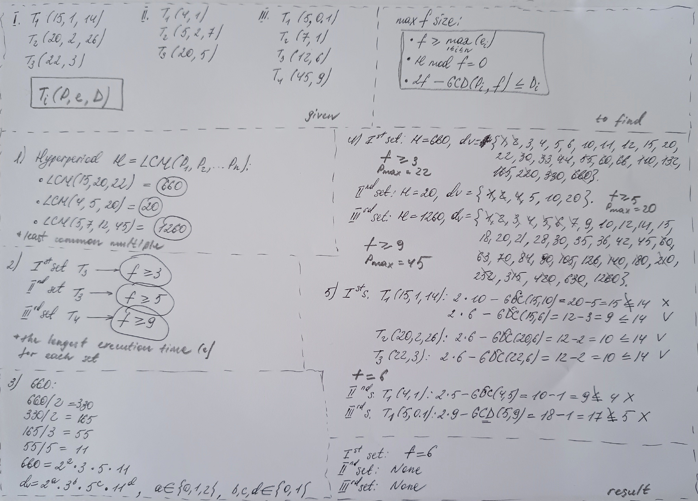
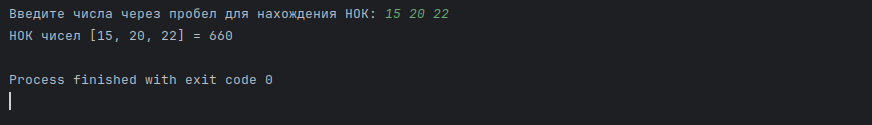
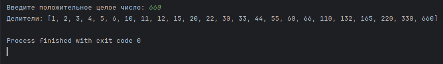
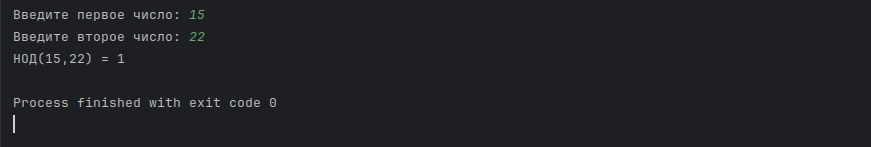
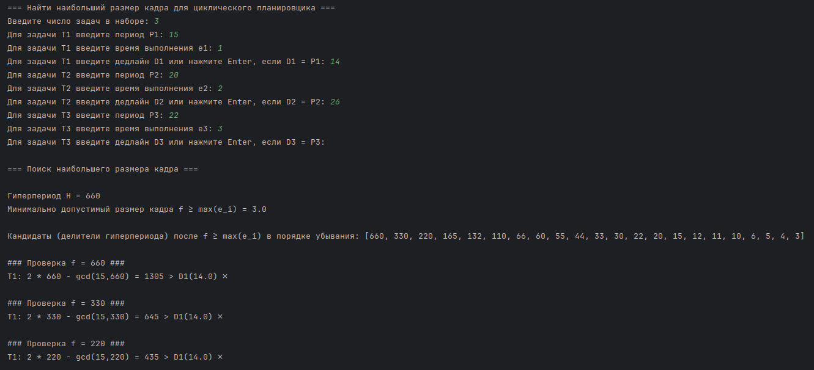
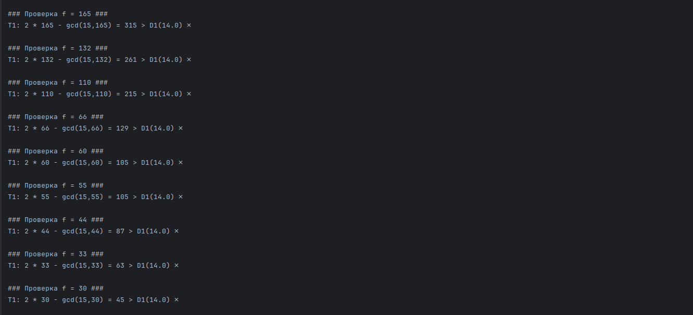
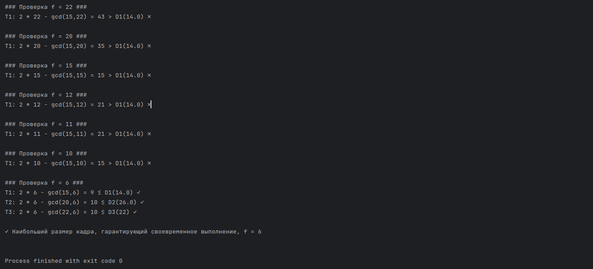

> > **The English-language version** is available [here](https://github.com/cloclacordis/rtos-eit-digital/blob/2cfedb804f26b7a105a76b30faa16d90653c286c/Module3/calculation/CalcJourEN.md). **The code** presented in this document can be found as `.py` files in [a separate folder](https://github.com/cloclacordis/rtos-eit-digital/tree/2cfedb804f26b7a105a76b30faa16d90653c286c/Module3/scripts).

## Обзор задач

Даны две задачи — одна **вычислительная**, на поиск выполнимого расписания для циклического планировщика, вторая — **на моделирование** с использованием **симулятора реального времени** для проверки выполнимости. Ниже приводится подробный журнал вычислений (*calculation journal*).

---

### Задача первая — вычислительная

#### Дано

Для циклического планировщика (*cyclic scheduler*) даны **три набора задач**:

**Набор задач первый**

| **Задача**       | **P** | **e** | **D** |
| ---------------- | ----- | ----- | ----- |
| T<sub>1</sub>    | 15    | 1     | 14    |
| T<sub>2</sub>    | 20    | 2     | 26    |
| T<sub>3</sub>    | 22    | 3     | 22    |

**Набор задач второй**

| **Задача**       | **P** | **e** | **D** |
| ---------------- | ----- | ----- | ----- |
| T<sub>1</sub>    | 4     | 1     | 4     |
| T<sub>2</sub>    | 5     | 2     | 7     |
| T<sub>3</sub>    | 20    | 5     | 20    |

**Набор задач третий**

| **Задача**       | **P** | **e** | **D** |
| ---------------- | ----- | ----- | ----- |
| T<sub>1</sub>    | 5     | 0.1   | 5     |
| T<sub>2</sub>    | 7     | 1     | 7     |
| T<sub>3</sub>    | 12    | 6     | 12    |
| T<sub>4</sub>    | 45    | 9     | 45    |

> Структура задачи: **T<sub>i</sub>(P,e,D)**,  
где **i** — номер задачи **T** данного набора задач;  
**P** — *период (period)*, или время между двумя последовательными активациями задачи;  
**e** — *время выполнения (execution time)*, или время, необходимое для полного (корректного) завершения задачи;  
**D** — *крайний срок (deadline)*, или предельное время, к которому задача должна быть завершена.  
> Если крайний срок **D** не задан явно — как, например, в **T<sub>3</sub>(22,3)**, — то **D = P**, следовательно, **T<sub>3</sub>(22,3,22)**.

---

#### Найти

Необходимо для каждого из трех наборов задач найти такой **наибольший размер кадра**, который гарантирует своевременное выполнение всех задач (*largest feasible frame size*) и удовлетворяет следующим **трем требованиям**:

**1**. **Длительность задачи**. Каждая задача **i** должна начинаться и завершаться в пределах одного кадра **f**. Следовательно, f должно быть не меньше максимального времени выполнения:  
**f ≥ max<sub>1≤i≤n</sub>(e<sub>i</sub>)**,  
где **e<sub>i</sub>** — время выполнения задачи **i**.  
	
**2**. **Делимость гиперпериода**. Кадр должен равномерно делить гиперпериод **H mod f = 0**, то есть делить без остатка.
	
> **Гиперпериодом** (*hyperperiod*) называется минимальный интервал, в который укладываются периоды всех задач.  
> Математически гиперпериод представляет собой **наименьшее общее кратное** (*least common multiple, LCM*) всех периодов данного набора задач.  
> Практически гиперпериод может быть использован для проверки выполнимости: если расписание укладывается в крайние сроки в течение одного гиперпериода, оно укладывается в крайние сроки всегда.  
> Для определения количества кадров **F** в гиперпериоде **H** используется простое деление: **F = H / f** (не путать с проверкой делимости **H mod f = 0**).
	
**3**. **Интервал между моментом запуска и крайним сроком выполнения**. Должен существовать как минимум один кадр, вмещающийся в интервал между моментом запуска задачи (*release time*) и крайним сроком ее выполнения.  
Иначе говоря, **2f − GCD(P<sub>i</sub>, f) ≤ D<sub>i</sub>**,  
где **f** — размер кадра;  
**P<sub>i</sub>** — период задачи **i**;  
**D<sub>i</sub>** — крайний срок выполнения задачи **i**;  
**GCD(P<sub>i</sub>, f)** — **наибольший общий делитель** (*greatest common divisor, GCD*) для значений периода и кадра.

---

#### Условия

Решение выполняется с использованием листа бумаги и ручки. **Черновик решения**:



> Далее будет подробно изложена логика решения задачи и предложен пример автоматизации вычислений.

---

#### Решение

**Логика поиска**

1. Найти гиперпериод **H = LCM(P<sub>1</sub>,P<sub>2</sub>,...,P<sub>n</sub>)**.  
2. Выбрать в качестве кандидатов такие размеры кадра **f**, которые:  
- являются делителями **H**,  
- удовлетворяют требованию **f ≥ max<sub>1≤i≤n</sub>(e<sub>i</sub>)**.  
3. Проверить выбранные **f** на условие **2f − GCD(P<sub>i</sub>, f) ≤ D<sub>i</sub>** для каждой задачи.  
4. Из прошедших проверку **f** выбрать максимальное значение для каждого набора задач.

---

**Шаг 1**

Найдем сперва **НОК** (*LCM*) периодов **P** для каждого набора.

- Для первого набора: LCM(15,20,22) = **660**.  
- Для второго набора: LCM(4,5,20) = **20**.  
- Для третьего набора: LCM(5,7,12,45) = **1260**.

> Чтобы найти НОК нескольких чисел вручную, нужно:  
> разложить каждое число на простые множители,  
> взять максимальные степени всех уникальных простых чисел,  
> перемножить их — результат и есть НОК.
>
> Например, НОК(12,18):  
> 12 = 2<sup>2</sup> * 3,  
> 18 = 2 * 3<sup>2</sup>,  
> НОК = 2<sup>2</sup> * 3<sup>2</sup> = 36.

**Пример автоматизированного поиска НОК для целых положительных чисел**

```python
import math
from functools import reduce

def lcm(a, b):
    return abs(a * b) // math.gcd(a, b)

def lcm_multiple(numbers):
    return reduce(lcm, numbers)

def get_numbers():
    while True:
        user_input = input("Введите числа через пробел для нахождения НОК: ")
        parts = user_input.strip().split()
        try:
            numbers = [int(p) for p in parts]
            if not numbers:
                raise ValueError("Список пуст.")
            if any(n <= 0 for n in numbers):
                raise ValueError("Все числа должны быть положительными.")
            return numbers
        except ValueError as e:
            print(f"Ошибка ввода: {e}. Попробуйте снова.\n")

def main():
    numbers = get_numbers()
    result = lcm_multiple(numbers)
    print(f"НОК чисел {numbers} = {result}")

if __name__ == "__main__":
    main()
```

Пример запуска:



---

**Шаг 2.1**

Найдем в каждом наборе задачу с максимальным временем выполнения **e** — она определяет минимально допустимое значение кадра **f**:

- Для первого набора: задача **T<sub>3</sub>(22,3)**, тогда **f ≥ 3**.  
- Для второго набора: задача **T<sub>3</sub>(20,5)**, тогда **f ≥ 5**.  
- Для третьего набора: задача **T<sub>4</sub>(45,9)**, тогда **f ≥ 9**.

---

**Шаг 2.2**

Согласно требованию, искомое значение кадра должно делить гиперпериод **H** нацело. Делители числа 660 можно получить, разложив исходное число на простые множители:

- 660 / 2 = 330,  
- 330 / 2 = 165, на 2 больше не делится -> запишем 2<sup>2</sup>,  
- 165 / 3 = 55, на 3 больше не делится -> запишем 3,  
- 55 / 5 = 11 -> запишем 5,  
- 11 — простое число -> запишем 11,  
- **660 = 2<sup>2</sup> * 3 * 5 * 11**.

Чтобы найти все положительные делители, нужно перебрать все возможные комбинации степеней этих множителей:

- от 0 до 2 для числа 2, то есть 2<sup>0</sup>, 2<sup>1</sup>, 2<sup>2</sup>,  
- от 0 до 1 для чисел 3, 5, 11 (так как они встречаются в разложении один раз).

Общая формула делителя:  
**div. = 2<sup>a</sup> * 3<sup>b</sup> * 5<sup>c</sup> * 11<sup>d</sup>**,  
где **a ∈ {0,1,2},  b, c, d ∈ {0,1}**.

Количество таких комбинаций:  
(2 + 1) * (1 + 1) * (1 + 1) * (1 + 1) = 3 * 2 * 2 * 2 = **24 делителя**.

Чтобы найти все делители, нужно, опираясь на формулу, перебрать все допустимые комбинации значений **a**, **b**, **c**, **d**:

- a = 0, b = 0, c = 0, d = 0 -> 2<sup>0</sup> * 3<sup>0</sup> * 5<sup>0</sup> * 11<sup>0</sup> = 1,  
- a = 1, b = 0, c = 1, d = 1 -> 2 * 1 * 5 * 11 = 110,  
- a = 2, b = 1, c = 1, d = 1 -> 4 * 3 * 5 * 11 = 660,  
- ...

> И так далее — пока не будут найдены все 24 комбинации.

**Пример автоматизированного поиска делителей для целого положительного числа**

```python
def get_divisors(n):
    if not isinstance(n, int) or n <= 0:
        raise ValueError("Введите целое положительное число")

    divisors = []
    for i in range(1, int(n**0.5) + 1):
        if n % i == 0:
            divisors.append(i)
            if i != n // i:
                divisors.append(n // i)
    return sorted(divisors)

# Пример использования:
number = int(input("Введите целое положительное число: "))
print("Делители:", get_divisors(number))
```

Пример запуска:



---

Итак, **все** делители гиперпериода **H** для каждого набора задач:

- Для первого набора, **H = 660**: 1, 2, 3, 4, 5, 6, 10, 11, 12, 15, 20, 22, 30, 33, 44, 55, 60, 66, 110, 132, 165, 220, 330, 660.  
- Для второго набора, **H = 20**: 1, 2, 4, 5, 10, 20.  
- Для третьего набора **H = 1260**: 1, 2, 3, 4, 5, 6, 7, 9, 10, 12, 14, 15, 18, 20, 21, 28, 30, 35, 36, 42, 45, 60, 63, 70, 84, 90, 105, 126, 140, 180, 210, 252, 315, 420, 630, 1260.

Применим требование к нижней границе кадра **f** и получим:

- Для первого набора, **f ≥ 3**, **f = {3, 4, 5, 6, 10, 11, 12, 15, 20, 22, 30, 33, 44, 55, 60, 66, 110, 132, 165, 220, 330, 660}**.  
- Для второго набора, **f ≥ 5**, **f = {5, 10, 20}**.  
- Для третьего набора, **f ≥ 9**, **f = {9, 10, 12, 14, 15, 18, 20, 21, 28, 30, 35, 36, 42, 45, 60, 63, 70, 84, 90, 105, 126, 140, 180, 210, 252, 315, 420, 630, 1260}**.

Используем максимальное значение периода **P<sub>max</sub>**, чтобы ограничить поиск кандидатов «сверху»:

- Для первого набора **P<sub>max</sub> = 22**.  
- Для второго набора, **P<sub>max</sub> = 20**.  
- Для третьего набора, **P<sub>max</sub> = 45**.

Применим к отфильтрованным кадрам сортировку в порядке убывания и получим **набор кандидатов** для проверки последнего требования:

- Для первого набора: **f<sub>rev</sub> = {22, 20, 15, 12, 11, 10, 6, 5, 4, 3}**.  
- Для второго набора: **f<sub>rev</sub> = {20, 10, 5}**.  
- Для третьего набора: **f<sub>rev</sub> = {45, 42, 36, 35, 30, 28, 21, 20, 18, 15, 14, 12, 10, 9}**.

---

**Шаг 3**

Проверим выполнение третьего требования для каждого набора задач: **2f − GCD(P<sub>i</sub>, f) ≤ D<sub>i</sub>**.

Напомним вкратце, что такое **наибольший общий делитель** (*GCD*) двух или более чисел: это наибольшее число, на которое делятся все данные числа без остатка. Простейший алгоритм нахождения *GCD*, или **Алгоритм Евклида** для двух чисел `a` и `b`:

1.  Пока `b ≠ 0`, выполнять:

```python
temp = b
b = a % b
a = temp
```

2. Когда `b = 0`, полученное значение `a` и есть *GCD*.
    
Или в виде функции:

```python
def gcd(a, b):
    while b != 0:
        a, b = b, a % b
    return a

# Ввод от пользователя
try:
    a = int(input("Введите первое число: "))
    b = int(input("Введите второе число: "))
    result = gcd(a, b)
    print(f"НОД({a},{b}) = {result}")
except ValueError:
    print("Ошибка: введите целые числа.")
```

Пример запуска:



---

**Проверка третьего требования**

- **Для первого набора задач**  
   - **T<sub>1</sub>(15,1,14)**  
     2 * 22 − GCD(15,22) = 44 − 1  = 43 > D<sub>1</sub>(14) -> **f = 22 не проходит**.  
     2 * 20 − GCD(15,20) = 40 − 5  = 35 > D<sub>1</sub>(14) -> **f = 20 не проходит**.  
     2 * 15 − GCD(15,15) = 30 − 15 = 15 > D<sub>1</sub>(14) -> **f = 15 не проходит**.  
     2 * 12 − GCD(15,12) = 24 − 3  = 21 > D<sub>1</sub>(14) -> **f = 12 не проходит**.  
     2 * 11 − GCD(15,11) = 22 − 1  = 21 > D<sub>1</sub>(14) -> **f = 11 не проходит**.  
     2 * 10 − GCD(15,10) = 20 − 5  = 15 > D<sub>1</sub>(14) -> **f = 10 не проходит**.  
     2 * 6  − GCD(15,6)  = 12 − 3  = 9  < D<sub>1</sub>(14) -> **f = 6  проходит**.
     
   - **T<sub>2</sub>(20,2,26)**  
     2 * 6 − GCD(20,6) = 12 − 2 = 10 < D<sub>2</sub>(26) -> **f = 6 проходит**.
     
   - **T<sub>3</sub>(22,3)**  
     2 * 6 − GCD(22,6) = 12 − 2 = 10 < D<sub>3</sub>(22) -> **f = 6 проходит**.

> Кандидат **f = 6** удовлетворяет третьему требованию для всех задач первого набора и не нарушает другие условия.

- **Для второго набора задач**  
   - **T<sub>1</sub>(4,1)**  
     2 * 20 − GCD(4,20) = 40 − 4 = 36 > D<sub>1</sub>(4) -> **f = 20 не проходит**.  
     2 * 10 − GCD(4,10) = 20 − 2 = 18 > D<sub>1</sub>(4) -> **f = 10 не проходит**.  
     2 * 5  − GCD(4,5)  = 10 − 1 = 9  > D<sub>1</sub>(4) -> **f = 5  не проходит**.  

> Ни один кандидат не прошел проверку по первой задаче (*no feasible frame size exists*). Проверка **T<sub>2</sub>**, **T<sub>3</sub>** не имеет смысла. **Циклическое планирование для данного набора задач невыполнимо**. Следует обратиться к другим методам (например, к динамическому планированию).

- **Для третьего набора задач**
   - **T<sub>1</sub>(5,0.1)**  
     2 * 45 − GCD(5,45) = 90 − 5 = 85 > D<sub>1</sub>(5) -> **f = 45 не проходит**.  
     2 * 42 − GCD(5,42) = 84 − 1 = 83 > D<sub>1</sub>(5) -> **f = 42 не проходит**.  
     2 * 36 − GCD(5,36) = 72 − 1 = 71 > D<sub>1</sub>(5) -> **f = 36 не проходит**.  
     2 * 35 − GCD(5,35) = 70 − 5 = 65 > D<sub>1</sub>(5) -> **f = 35 не проходит**.  
     2 * 30 − GCD(5,30) = 60 − 5 = 55 > D<sub>1</sub>(5) -> **f = 30 не проходит**.  
     2 * 28 − GCD(5,28) = 56 − 1 = 55 > D<sub>1</sub>(5) -> **f = 28 не проходит**.  
     2 * 21 − GCD(5,21) = 42 − 1 = 41 > D<sub>1</sub>(5) -> **f = 21 не проходит**.  
     2 * 20 − GCD(5,20) = 40 − 5 = 35 > D<sub>1</sub>(5) -> **f = 20 не проходит**.  
     2 * 18 − GCD(5,18) = 36 − 1 = 35 > D<sub>1</sub>(5) -> **f = 18 не проходит**.  
     2 * 15 − GCD(5,15) = 30 − 5 = 25 > D<sub>1</sub>(5) -> **f = 15 не проходит**.  
     2 * 14 − GCD(5,14) = 28 − 1 = 27 > D<sub>1</sub>(5) -> **f = 14 не проходит**.  
     2 * 12 − GCD(5,12) = 24 − 1 = 23 > D<sub>1</sub>(5) -> **f = 12 не проходит**.  
     2 * 10 − GCD(5,10) = 20 − 5 = 15 > D<sub>1</sub>(5) -> **f = 10 не проходит**.  
     2 * 9  − GCD(5,9)  = 18 − 1 = 17 > D<sub>1</sub>(5) -> **f = 9  не проходит**.  

> Ни один кандидат не прошел проверку по первой задаче (*no feasible frame size exists*). Проверка **T<sub>2</sub>**, **T<sub>3</sub>** не имеет смысла. **Циклическое планирование для данного набора задач невыполнимо**. Следует обратиться к другим методам (например, к динамическому планированию).

---

**Шаг 4**

Из прошедших проверку значений **f** следовало бы выбрать наибольшее, однако проверку прошел только первый набор — с единственным значением **f = 6**.

---

#### Результат

Следовательно:

- Для первого набора: **f = 6**.  
- Для второго набора: **допустимый размер кадра отсутствует** (*no feasible frame size exists*).  
- Для третьего набора: **допустимый размер кадра отсутствует** (*no feasible frame size exists*).

---

#### Автоматизация

Решение данной задачи может быть автоматизировано:

```python
import math

def lcm(a, b):
    """Вычисляем наименьшее общее кратное (НОК) двух чисел"""
    return a * b // math.gcd(a, b)

def compute_hyperperiod(periods):
    """Вычисляем гиперпериод списка периодов."""
    H = periods[0]
    for p in periods[1:]:
        H = lcm(H, p)
    return H

def get_divisors(n):
    """Возвращаем отсортированный список всех делителей числа n."""
    divisors = []
    for i in range(1, int(math.sqrt(n)) + 1):
        if n % i == 0:
            divisors.append(i)
            if i != n // i:
                divisors.append(n // i)
    return sorted(divisors)

def find_max_frame(tasks):
    """
    Ищем наибольший размер кадра для набора задач.
    Задача = список словарей {'P': период, 'e': время выполнения, 'D': дедлайн}.
    """
    periods = [t['P'] for t in tasks]
    exec_times = [t['e'] for t in tasks]
    deadlines = [t['D'] for t in tasks]

    # Заголовок расчетов
    print("\n=== Поиск наибольшего размера кадра ===\n")

    # Шаг 1: вычисление гиперпериода и минимально допустимого размера кадра
    H = compute_hyperperiod(periods)
    e_max = max(exec_times)
    print(f"Гиперпериод H = {H}")
    print(f"Минимально допустимый размер кадра f ≥ max(e_i) = {e_max}\n")

    # Шаг 2: вычисление делителей гиперпериода, проверка f ≥ max(e_i), вывод в порядке убывания
    divisors = get_divisors(H)
    candidates = [f for f in divisors if f >= e_max]
    candidates.sort(reverse=True)
    print("Делители гиперпериода, удовлетворяющие f ≥ max(e_i), в порядке убывания:", candidates, "\n")

    # Шаг 3: проверка критерия своевременного выполнения (2f – gcd ≤ D)
    for f in candidates:
        print(f"### Проверка f = {f} ###")
        all_pass = True
        for idx, (P, e, D) in enumerate(zip(periods, exec_times, deadlines), start=1):
            gcd_val = math.gcd(P, f)
            lhs = 2 * f - gcd_val
            if lhs <= D:
                print(f"T{idx}: 2 * {f} - gcd({P},{f}) = {lhs} ≤ D{idx}({D}) ✓")
            else:
                print(f"T{idx}: 2 * {f} - gcd({P},{f}) = {lhs} > D{idx}({D}) ✗")
                all_pass = False
                break
        if all_pass:
            print(f"\n✓ Наибольший размер кадра, гарантирующий своевременное выполнение, f = {f}\n")
            return
        print()  # разделитель

    print("✗ Не существует наибольшего размера кадра, гарантирующего своевременное выполнение\n")

def main():
    print("=== Найти наибольший размер кадра для циклического планировщика ===")
    try:
        n = int(input("Введите число задач в наборе: "))
        if n <= 0:
            raise ValueError
    except ValueError:
        print("Ошибка: введите целое положительное число.")
        return

    tasks = []
    for i in range(1, n+1):
        try:
            P = int(input(f"Для задачи T{i} введите период P{i}: "))
            if P <= 0:
                raise ValueError
        except ValueError:
            print("Ошибка: период должен быть целым положительным числом.")
            return

        try:
            e = float(input(f"Для задачи T{i} введите время выполнения e{i}: "))
            if e <= 0:
                raise ValueError
        except ValueError:
            print("Ошибка: время выполнения должно быть положительным числом.")
            return

        D_input = input(f"Для задачи T{i} введите дедлайн D{i} или нажмите Enter, если D{i} = P{i}: ")
        if D_input.strip() == "":
            D = P
        else:
            try:
                D = float(D_input)
                if D <= 0:
                    raise ValueError
            except ValueError:
                print("Ошибка: дедлайн должен быть целым положительным числом.")
                return

        tasks.append({'P': P, 'e': e, 'D': D})

    find_max_frame(tasks)

if __name__ == "__main__":
    main()
```

Пример запуска:







---

### Задача вторая — на моделирование

