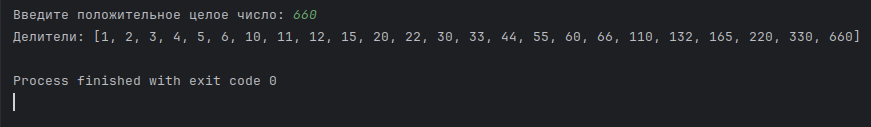
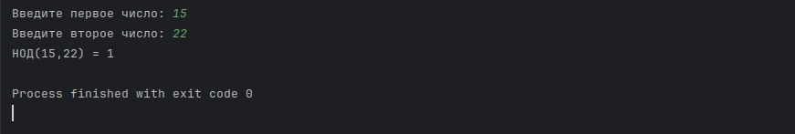

## Обзор задач

Дано две задачи — одна **вычислительная**, на поиск выполнимого расписания для циклического планировщика, вторая — **на моделирование** с использованием **симулятора реального времени** для проверки выполнимости. Ниже описываются формулировки и требования обеих задач, условия и сведения, необходимые для выполнения, приводится подробный журнал решений.

---

### Задача первая

#### Дано

Для циклического планировщика (*cyclic scheduler*) дано **три набора задач**:

**Набор задач первый**

| **Задача** | **P** | **e** | **D** |
| ---------- | ----- | ----- | ----- |
| T₁         | 15    | 1     | 14    |
| T₂         | 20    | 2     | 26    |
| T₃         | 22    | 3     | 22    |

**Набор задач второй**

| **Задача** | **P** | **e** | **D** |
| ---------- | ----- | ----- | ----- |
| T₁         | 4     | 1     | 4     |
| T₂         | 5     | 2     | 7     |
| T₃         | 20    | 5     | 20    |

**Набор задач третий**

| **Задача** | **P** | **e** | **D** |
| ---------- | ----- | ----- | ----- |
| T₁         | 5     | 0.1   | 5     |
| T₂         | 7     | 1     | 7     |
| T₃         | 12    | 6     | 12    |
| T₄         | 45    | 9     | 45    |

> Структура задачи: **T<sub>n</sub>(P,e,D)**, где **P** — *период (period)*, или время между двумя последовательными активациями задачи; **e** — *время выполнения (execution time)*, или длительность, необходимая для нормального завершения задачи; **D** — *крайний срок (deadline)*, или предельное время, к которому задача должна быть завершена.
> Если крайний срок **D** не задан явно — как, например, в **T<sub>3</sub>(22,3)**, — то **D = P**, следовательно, **T<sub>3</sub>(22,3,22)**.

---

#### Найти

Необходимо *для каждого из трех наборов* задач найти:

**1**. *Наибольший размер кадра*, который гарантирует своевременное выполнение всех задач (*largest feasible frame size*).

**2**. Такой размер, чтобы помимо выполнялись следующие *три требования*:

**a**. *Длительность задачи*. Каждая задача **i** должна начинаться и завершаться в пределах одного кадра **f**.  
Следовательно, **f ≥ max<sub>1 ≤ i ≤ n</sub>(e<sub>i</sub>)**, где **e<sub>i</sub>** — время выполнения (*execution time*) задачи **i**.
Никакой кадр не может быть меньше, чем самая длительная задача.
	
**b**. *Делимость гиперпериода*. Размер кадра должен равномерно (нацело) делить гиперпериод **H mod f = 0** (или **H % f == 0**).
	
> **Гиперпериодом** (*hyperperiod*) называется минимальный интервал, в который укладываются периоды всех задач. Математически гиперпериод представляет собой **наименьшее общее кратное** (*least common multiple, LCM*) всех периодов. Практически гиперпериод используется для проверки выполнимости: если расписание укладывается в крайние сроки в течение одного гиперпериода, оно будет укладываться всегда.  
> Для определения *количества кадров* **F** в гиперпериоде **H** используется простое деление: **F = H / f** (не путать с *проверкой делимости* **H mod f = 0**).
	
**c**. *Интервал между релизом и дедлайном*. Должен существовать как минимум один кадр, умещающийся между моментом запуска задачи (*release time*) и крайним сроком ее выполнения (*deadline*).  
Иначе говоря: **2f − GCD(P<sub>i</sub>, f) ≤ D<sub>i</sub>**, где **f** — размер кадра; **P<sub>i</sub>** — период задачи **i**; **D<sub>i</sub>** — крайний срок выполнения задачи **i**; **GCD(P<sub>i</sub>, f)** — наибольший общий делитель (*greatest common divisor, GCD*) для значений периода и кадра.

---

#### Условия

Решение выполняется с использованием листа бумаги и ручки.

> Дополнительно будет предложен пример автоматизации решения.

---

#### Решение

**Логика поиска**

1. Найти гиперпериод **H = LCM(P<sub>1</sub>,P<sub>2</sub>,...,P<sub>n</sub>)**.  
2. Выбрать среди кандидатов кадры **f** (делители **H**), которые:  
- **≥ max<sub>1 ≤ i ≤ n</sub>(e<sub>i</sub>)** — требование 1,  
- **H mod f = 0** — требование 2.  
3. Проверить выбранные **f** на условие **2f − GCD(P<sub>i</sub>, f) ≤ D<sub>i</sub>** для всех задач — требование 3.  
4. Из прошедших проверку **f** выбрать максимальное.

---

**Шаг 1**

Найдем сперва **НОК** (*LCM*) периодов **P** для каждого набора.

- Для первого набора: LCM(15,20,22) = **660**.  
- Для второго набора: LCM(4,5,20) = **20**.  
- Для третьего набора: LCM(5,7,12,45) = **1260**.

---

**Шаг 2.1**

Найдем для каждого набора требование к нижней границе **f**, а именно задачу с самым большим временем выполнения **e**.

- Для первого набора: задача T<sub>3</sub>(22,3), тогда **f ≥ 3**.  
- Для второго набора: задача T<sub>3</sub>(20,5), тогда **f ≥ 5**.  
- Для третьего набора: задача T<sub>4</sub>(45,9), тогда **f ≥ 9**.

---

**Шаг 2.2**

Согласно второму требованию, искомое значение кадра должно делить гиперпериод **H** нацело.

**Пример «ручного» поиска делителей для числа 660**  
Разложим 660 на простые множители:

660 / 2 = 330,  
330 / 2 = 165, больше не делится на 2, запишем 2<sup>2</sup>.  
165 / 3 = 55, больше не делится на 3, запишем 3.  
55 / 5 = 11, запишем 5.  
Осталось 11 — простое число, запишем 11.  
Итого: **660 = 2<sup>2</sup> * 3 * 5 * 11**.  

Каждый делитель числа 660 — это число, которое можно «собрать», взяв **степени** из разложения:

- от 0 до 2 для 2,  
- от 0 до 1 для 3,  
- от 0 до 1 для 5,  
- от 0 до 1 для 11.

Соберем возможные комбинации этих степеней:

**d = 2<sup>a</sup> * 3<sup>b</sup> * 5<sup>c</sup> * 11<sup>d</sup>, a ∈ {0,1,2},  b, c, d ∈ {0,1}**.

Количество (положительных) делителей: 3 * 2 * 2 * 2 = **24**. Чтобы найти **все делители**, нужно перебрать **все комбинации** указанных выше степеней и для каждой вычислить значение по формуле.

**Пример автоматизированного поиска делителей для положительного целого числа**
```python
def get_divisors(n):
    if not isinstance(n, int) or n <= 0:
        raise ValueError("Введите положительное целое число")

    divisors = []
    for i in range(1, int(n**0.5) + 1):
        if n % i == 0:
            divisors.append(i)
            if i != n // i:
                divisors.append(n // i)
    return sorted(divisors)

# Пример использования:
number = int(input("Введите положительное целое число: "))
print("Делители:", get_divisors(number))
```

Запуск, ввод, вывод:



---

Итак, **все** делители гиперпериода **H** для каждого набора задач:

- Для первого набора, **H = 660**: 1, 2, 3, 4, 5, 6, 10, 11, 12, 15, 20, 22, 30, 33, 44, 55, 60, 66, 110, 132, 165, 220, 330, 660.  
- Для второго набора, **H = 20**: 1, 2, 4, 5, 10, 20.  
- Для третьего набора **H = 1260**: 1, 2, 3, 4, 5, 6, 7, 9, 10, 12, 14, 15, 18, 20, 21, 28, 30, 35, 36, 42, 45, 60, 63, 70, 84, 90, 105, 126, 140, 180, 210, 252, 315, 420, 630, 1260.

Применим требование к нижней границе кадра **f** и получим:

- Для первого набора, **f ≥ 3**, **f = {3,4,5,6,10,11,12,15,20,22,30,33,44,55,60,66,110,132,165,220,330,660}**.  
- Для второго набора, **f ≥ 5**, **f = {5,10,20}**.  
- Для третьего набора, **f ≥ 9**, **f = {9,10,12,14,15,18,20,21,28,30,35,36,42,45,60,63,70,84,90,105,126,140,180,210,252,315,420,630,1260}**.

Вспомним максимальные значения периодов **P**, чтобы ограничить поиск кандидатов «сверху»:

- Для первого набора **P<sub>max</sub> = 22**.  
- Для второго набора, **P<sub>max</sub> = 20**.  
- Для третьего набора, **P<sub>max</sub> = 45**.

Отсортируем кадры в порядке убывания и получим **набор кандидатов** для проверки третьего требования:

- Для первого набора: **f<sub>rev</sub> = {22,20,15,12,11,10,6,5,4,3}**.  
- Для второго набора: **f<sub>rev</sub> = {20,10,5}**.  
- Для третьего набора: **f<sub>rev</sub> = {45,42,36,35,30,28,21,20,18,15,14,12,10,9}**.

---

**Шаг 3**

Проведем проверки третьего требования к полученным наборам: **2f − GCD(P<sub>i</sub>, f) ≤ D<sub>i</sub>**, где **f** — размер кадра; **P<sub>i</sub>** — период задачи **i**; **D<sub>i</sub>** — крайний срок выполнения задачи **i**; **GCD(P<sub>i</sub>, f)** — наибольший общий делитель (*greatest common divisor, GCD*) для значений периода и кадра.

Напомним вкратце, что такое **наибольший общий делитель** (*GCD*) двух или более чисел: это наибольшее число, на которое делятся все данные числа без остатка.

Простейший алгоритм нахождения *GCD*, или **Алгоритм Евклида** для двух чисел `a` и `b`:

1.  До тех пор, пока `b ≠ 0`, выполнять:

```python
temp = b
b = a % b
a = temp
```

2. Когда `b = 0`, значение `a` — и есть *GCD*.
    
Или:

```python
def gcd(a, b):
    while b != 0:
        a, b = b, a % b
    return a

# Ввод от пользователя
try:
    a = int(input("Введите первое число: "))
    b = int(input("Введите второе число: "))
    result = gcd(a, b)
    print(f"НОД({a},{b}) = {result}")
except ValueError:
    print("Ошибка: введите целые числа.")
```

Запуск, ввод, вывод:



---

Начнем **проверки третьего требования**.

- Для первого набора:  
   * **T<sub>1</sub>**:  
     2 * 22 - GCD(15,22) = 44 - 1  = 43 > D<sub>1</sub>(14). Кандидат **f = 22 не подходит**.  
     2 * 20 - GCD(15,20) = 40 - 5  = 35 > D<sub>1</sub>(14). Кандидат **f = 20 не подходит**.  
     2 * 15 - GCD(15,15) = 30 - 15 = 15 > D<sub>1</sub>(14). Кандидат **f = 15 не подходит**.  
     2 * 12 - GCD(15,12) = 24 - 3  = 21 > D<sub>1</sub>(14). Кандидат **f = 12 не подходит**.  
     2 * 11 - GCD(15,11) = 22 - 1  = 21 > D<sub>1</sub>(14). Кандидат **f = 11 не подходит**.  
     2 * 10 - GCD(15,10) = 20 - 5  = 15 > D<sub>1</sub>(14). Кандидат **f = 10 не подходит**.  
     2 * 6  - GCD(15,6)  = 12 - 3  = 9  < D<sub>1</sub>(14). Кандидат **f = 6 подходит**.
     
     
   * **T<sub>2</sub>**:  
     2 * 6 - GCD(20,6) = 12 - 2 = 10 < D<sub>2</sub>(26). Кандидат **f = 6 подходит**.
     
   * **T<sub>3</sub>**:  
     2 * 6 - GCD(22,6) 12 - 2 = 10 < D<sub>3</sub>(22). Кандидат **f = 6 подходит**.

> Выбор кандидата **f = 6** проходит проверки по третьему требованию для первого набора и не нарушает других требований.

- Для второго набора:  
   * T<sub>1</sub>:  
     2 * 20 - GCD()
   
   * T<sub>2</sub>: .  
   * T<sub>3</sub>: .  

- Для третьего набора:
   * T<sub>1</sub>: .  
   * T<sub>2</sub>: .  
   * T<sub>3</sub>: .  
   * T<sub>4</sub>: .

---

**Шаг 4**


---

#### Результат

---

### Задача вторая

